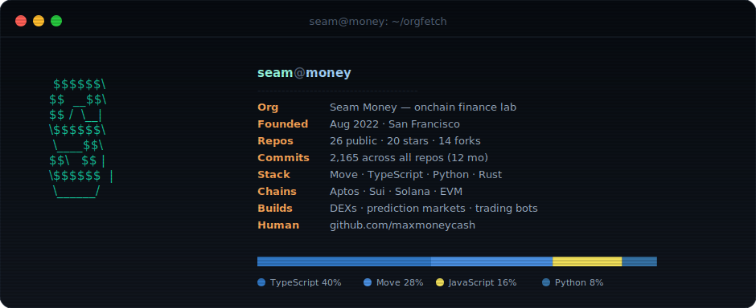
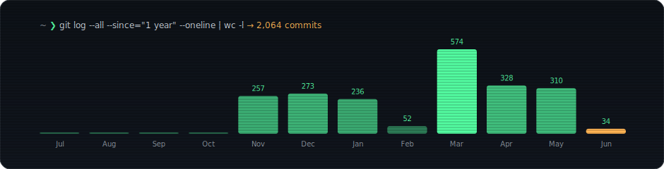

## <samp>~ ❯ git shortlog --all --summary</samp>

## <samp>~ ❯ ls ~/seammoney --sort=stars</samp>

<!-- REPOS:START -->
<table width="100%"><tr><td width="50%"><a href="https://github.com/SeamMoney/tx-composer"><b><samp>tx-composer</samp></b></a>  Simulate-first DeFi transaction composer for Aptos ⭐ 5 · ⑂ 0</td><td width="50%"><a href="https://github.com/SeamMoney/seam-frontend"><b><samp>seam-frontend</samp></b></a>  Aptos Move Module Explorer and Txn Runner ⭐ 4 · ⑂ 4</td></tr><tr><td width="50%"><a href="https://github.com/SeamMoney/aptos-polymarket"><b><samp>aptos-polymarket</samp></b></a>  Polymarket Clone on Aptos with HFT Trading Bots to Showcase Aptos' TPS ⭐ 2 · ⑂ 0</td><td width="50%"><a href="https://github.com/SeamMoney/MoveGPT"><b><samp>MoveGPT</samp></b></a>   ⭐ 2 · ⑂ 0</td></tr><tr><td width="50%"><a href="https://github.com/SeamMoney/seam-contracts"><b><samp>seam-contracts</samp></b></a>   ⭐ 2 · ⑂ 4</td><td width="50%"><a href="https://github.com/SeamMoney/cash.trading"><b><samp>cash.trading</samp></b></a>  cash.trading Decibel trading frontend, automation, and CASH rewards on Aptos ⭐ 1 · ⑂ 1</td></tr></table>
<!-- REPOS:END -->

 

<samp>cards re-rendered daily by GitHub Actions · founder profile at <a href="https://github.com/maxmoneycash">@maxmoneycash</a></samp>

