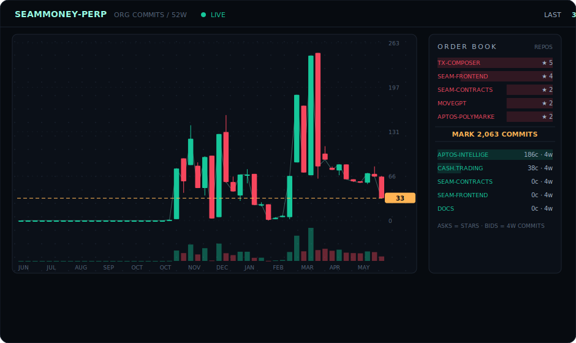
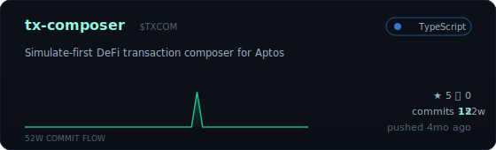
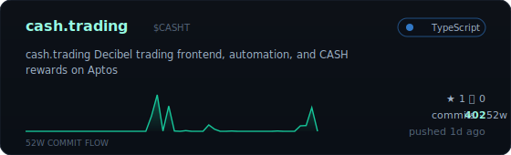
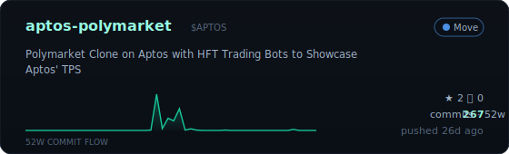
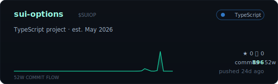
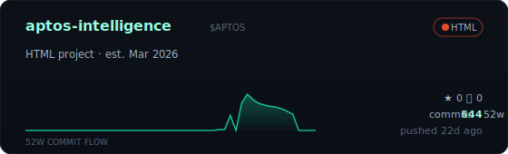
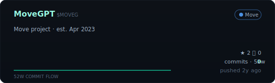
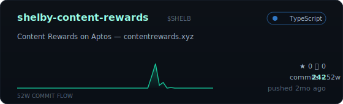
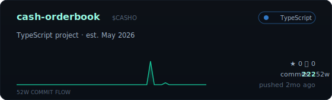

## <samp>~ ❯ seam perp --commits</samp>

## <samp>~ ❯ ls ~/seammoney --sort=dope</samp>

<!-- REPOS:START -->

<!-- REPOS:END -->

 

<samp>cards re-rendered daily by GitHub Actions · founder profile at <a href="https://github.com/maxmoneycash">@maxmoneycash</a></samp>

